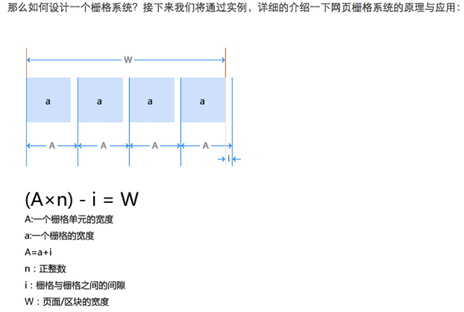
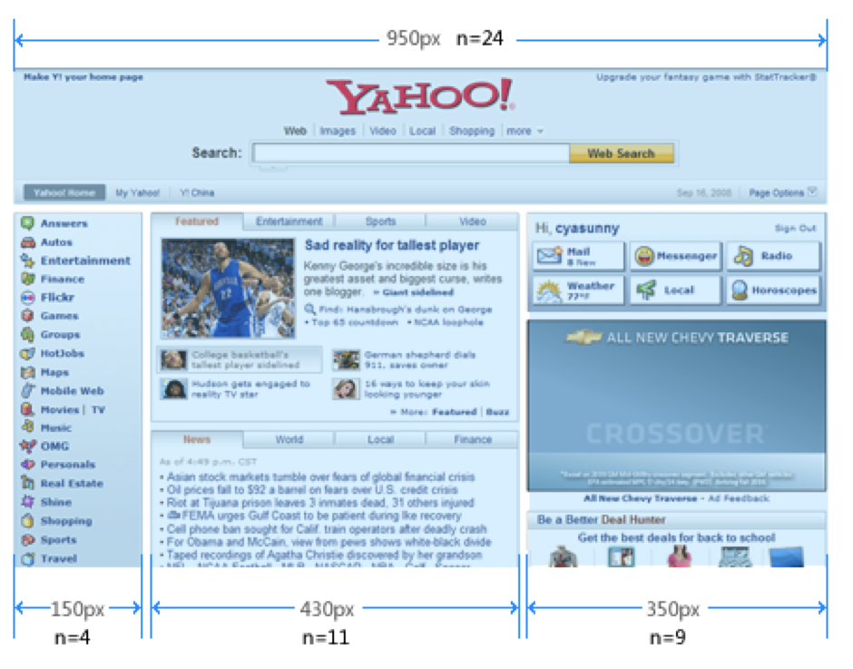

kiwizhang.zd  Thur,July 23,2015,Sunny
----------------------
## 1.熟悉交易线业务.（淘宝测试环境出现了问题，上午未能完成整个交易流程的模拟）
 正向交易流程：
买家下单——>买家付款——>卖家发货——>确认收货——>买家评论
 逆向交易流程：
买家下单→
## 2.熟悉fmd——html规范
2.1页面采用栅格系统布局，（什么是栅格系统？采用规则的网格列阵来指导和规范网页中的版面布局以及信息分布）。
如何计算一个网页的栅格化的宽度？以一个yahoo页面为例。
  假设：
  
  解：从左至右每个块分别由n1,n2,n3(全部为正整数)个格子组成，那么每个块的宽度的计算就是：
  
o   n1*A-10=150

o   n2*A-10=440

o   n3*A-10=350

o   那么n1*A＝160，n2*A＝440，n3*A＝360，由于n1,n2,n3(全部为正整数)，那么求的是160，440，360的最大公约数，就是40，所以A=40

•	2.2 风格统一规范
layer是一个全屏幕的通栏，layout是一个页面的通栏，将一个layout分成几栏就是grid，当然也可以不分栏，直接包含mod，mod是可重复的内容块，必须按规定格式书写，同时，mod中可以包含zone和unit,zone和unit是可重复的元素，两个区别是zone可以包含unit，但是unit不可以包含zone，lang是一个标签或者一个不可拆分的组件。

## 3.熟悉FMD 规范－js
   3.1 AMD 意思是异步模块定义，采用异步方式加载模块，模块的加载不影响后面语句的运行，所有依赖这个模块的语句，都定义在一个回调函数中，等加载完成之后，回调才会执行。
   
   3.2 FMD.js
   
   3.2.1 FMD的内置模块
   
•	（1）require 的功能是取得其他模块的接口

•	（2）exports 也是内建模块，其接口是个对象，代表当前正在定义的模块的返回对象（在定义的模块内不需要再显示的使用return返回这个对象），需要对这个返回对象添加属性或者方法。

•	（3）module内建模块，代表当前正在定义的模块，在定义的模块内部，使用module的exports方法导出该模块的接口。

