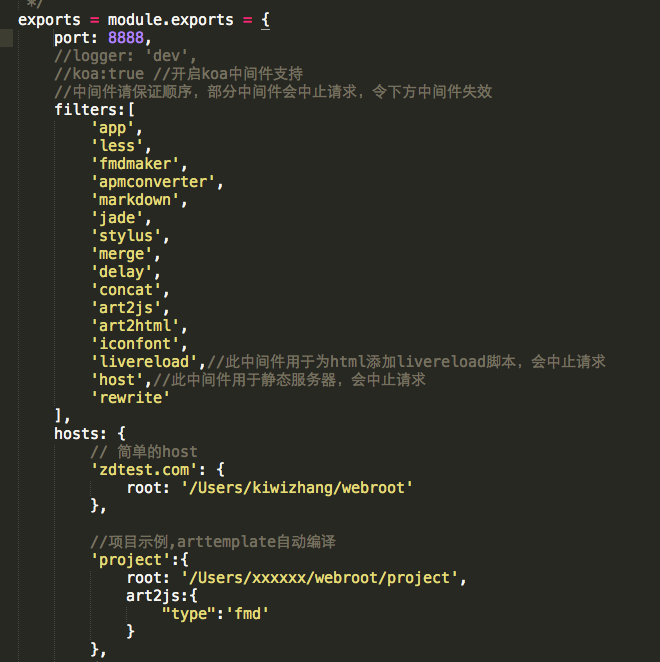

**kiwizhang.zd Tues,28,July,2015,sunny**

### git的fetch、pull、diff
   **问题**：今天在git的服务器端删掉了一个文件，也就是说服务器端的项目改变了，那么如何将服务器的改变同步到本地呢？ 
   
   **解决**：使用fetch或者pull命令,fetch相当于从远程服务器获取最新版本到本地，不会自动merge
   
   ```
   git fetch origin master:tmp
   git diff tmp
   git merge tmp
   
   ```
   从远程获取最新版本到本地的tmp分支上，然后进行合并，该段的命令和下面这个是一样的,也就是说我们用pull的时候会自动获取服务器的版本，然后自动merge，fetch比pull更加安全，因为在合并版本之前我们可以查看更新情况
   
   ```
   git pull origin master
   
   ```
   git文件提交涉及到三方面的内容，working tree、index file、commit。
   
   * working tree：就是物理磁盘上的文件，每当做出修改之后，保存，那么working tree的内容也就改变了
   * index file：就是当前目录被索引了的文件，例如新添加的文件，通过git add xxx ，那么该文件就从working tree被添加到了index file中
   * commit：通过commit命令的文件，就从index file 添加到了commit中
   
   diff命令：
   
   ```
   git diff ;查看的是working tree和index file的区别
   git diff --cache ;查看的是index file 和commit的区别
   git diff HEAD ;查看的是working tree和最近一次commit的区别（HEAD表示的是最近一次的commit信息）
   git diff 分支名 ;查看的是当前分支与该分支的区别
   
   ```
###neat工具
neat是一个前段开发工具集合平台，今天试着配置使用了一下[neat server](http://gitlab.alibaba-inc.com/neat/neat-doc/raw/master/_book/install.html)，把步骤记录如下：

  1.安装neat server。
  首先要有装好node.js,然后npm，然后tnpm，在[这儿](http://ctf.alibaba.net/landing/env/workspace.html)都能找到相关的安装教程。然后一行命令安装neat server：
  
  ```
  tnpm install -g @ali/neat@2.x
  
  ```
  
 2.然后start这个neat server，命令：
 
 ```
 neat server start
 ```
 
 3.然后在配置文件中配置一个网站，配置如下
    
   在中间配置了一个域名为zdtest.com一个网站，然后配置了网站的根资源目录，为了通过域名访问该网址，还需要在host文件（/etc/hosts）中配置该网址对应的ip.
   
 4.在浏览器中输入zdtest.com:8888/index.html
 
   在这一步遇到了很多问题，其中一个就是在控制台服务启动成功了，但是在浏览器中输入地址却加载不了页面，原因在于一开始的时候，我在net server中开启的是80端口，<span style='color:red'>注意在mac中,如果启动的是80端口，就要使用sudo neat server start</span>来启动这个服务，如果不是80端口，那么使用普通命令启动就可以了。
### 搭建本地的style服务器
配置好neat服务器，从git上面clone style项目至本地，然后绑定线上的静态资源域名至本地服务器，就可以了。其中主要是线上请求的是css文件，而本地的style项目只有less文件，注意在neat server config中进行过滤配置。   
  


