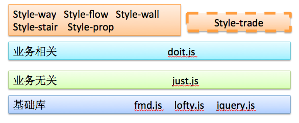
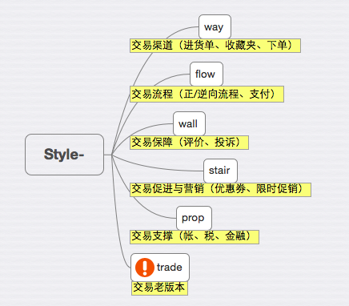

**kiwizhang.zd Thur,30,July,2015,sunny**
### 熟悉相关业务和职责
师父今天介绍了整个1688的部门划分，以及交易平台的部门划分，各部门业务分配，以及整个交易平台前端的主要职责。

1688技术部门划分为搜索部，垂直行业等等，交易。。。记不清了
交易平台的部门主要有买家工具，交易流程，纠纷维权，关系营销，交易账务，这些都是根据整个交易流程纵向划分的业务部门，这些部门完成的都是后端的开发，而交易的前端部门，负责所有交易相关的页面，无论是pc端的还是无线端的，是一个横向的部门，并且每一个无线业务的负责人都是一个前端开发工程师。此外，每一名前端开发工程师还要学习如何测试自己的代码，会书写**TC**。

作为一个交易平台的一名前端开发工程师，在开发过程中涉及到**交易金额**的处理的时候，都要特别小心和注意。并且要随时注意**工单处理**是工作的第一位，这也是践行阿里客户第一的行为准则。

### 确定了试用期的相关绩效评定的准则 

评定的准则是：对于本岗位的**任务和产出**都很了解，能完成相对复杂的任务，能够作为独立的项目组成员。

### 项目简介

介绍了整个1688交易前端项目的组织架构。

