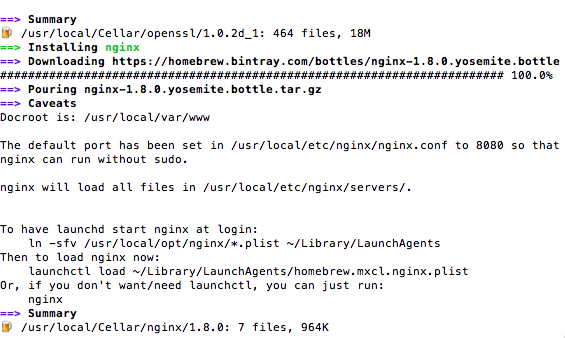

**kiwizhang.zd Thur,31,July,2015,sunny**
### 熟悉订单页面

### 搭建本地的nginx服务器（mac环境,使用npm安装的node）

* neat的ssl认证证书和key存放的路径：/usr/local/lib/node_modules/@ali/neat/node_modules/@ali/fdserver/cert/neat.crt  

   /usr/local/lib/node_modules/@ali/neat/node_modules/@ali/fdserver/cert/neat.key
* 使用brew安装nginx，安装完成消息提示如下：
   
* nginx配置文件

```

server {

    listen 80;
	listen 443 ssl;
    server_name  astyle-src.alicdn.com;
	root /Users/kiwizhang/workspace/git-project/style;
	ssl_certificate /usr/local/lib/node_modules/@ali/neat/node_modules/@ali/fdserver/cert/neat.crt;
	ssl_certificate_key /usr/local/lib/node_modules/@ali/neat/node_modules/@ali/fdserver/cert/neat.key;
	location / {

            if (!-f $request_filename){
			rewrite ^/(.*)$ /$1?_v=150701 break;
			proxy_pass https://astyle.alicdn.com;
		}
        }
}

```
### WebComponent

模板元素，装饰者模式，自定义标签，Shadow DOM

