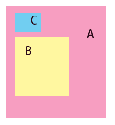

### css 组件抽象的一些问题

* 在抽象页面的组件书写对应的css的时候，注意定位属性的使用。例如此处的一个组件，里面包含了C，B两个小组件，那么在css中，A就不应该包含**margin，position(position＝absolute，fixed)，float**这些属性以及属性对应的取值，在复用组件的时候再根据页面实际的布局进行设置，但是包含的小组件CB可以包含相对于A的定位。

* 在引用的时候，注意css文件的顺序性

### mac

在mac中很多命令如果没有执行效果，那么可能是权限的问题，使用sudo来解决

### css规范

读了一小节规范，内容很多，再加上是英文，速度较慢。但是的确比翻译的中文描述得要准确得多。继续慢慢啃。。
收获笔记详见 <http://gitlab.alibaba-inc.com/kiwizhang.zd/kiwi-blog/blob/master/Note-Book/CSS-visual-formatting-model.md>
