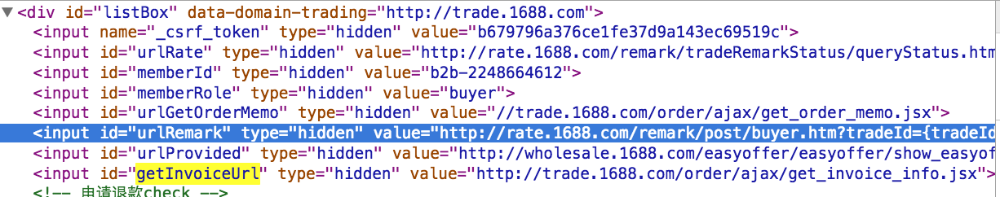

**kiwizhang.zd Mon,3,Aug,2015,Sunny**
###买家订单
问题：如图所示的这些节点是怎么渲染的？通过模板塞入值？fevlib这个里面是些什么东西？

买家订单和进货单页面有很大的区别，前者的页面没有经过改造，使用的是老版本的style-trade，老版本有很多注释，读起来很容易读懂，其中一部分功能，使用的依赖很少，很容易理清编码思路。
### velocity模板

```
!$vari ## 对vari变量的取值求反
$!vari ## 如果不存在vari这个变量，页面也不会输出错误，相当于是对vari做一个容错处理
```

### 买家促销中心
  
买家促销中心的关注店铺优惠展示页面的css设计，包括概要和详细设计。
