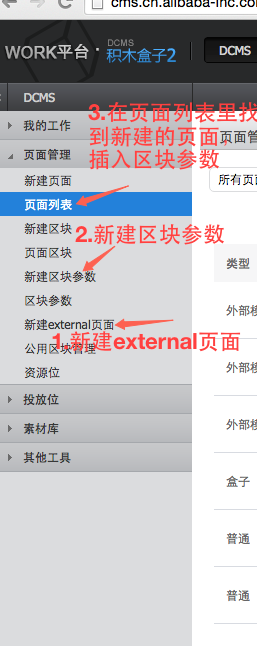

###ul li;ol li;dl dt dd   三个列表的使用区别
ul li  是无序列表；
ol li  是有序列表，带有标号。
dl dt dd  ，嵌套的列表

###ie7下table错乱
 需要给每一个td设置宽度，只给th设置宽度，不会影响同列td的宽度，同时需要设置px，不要设置%，这样会有问题
 
### flow code-review

1.重构了css文件结构，分离了表单区域和支付方式区域的样式，分写到两个文件中

2.根据新的模块id的resovle规则，改写了模块的命名，加入了应用的名字

### 完成变更需求之后的未签约页面
新增了一个弹出层，展示签约协议。

###CMS 管理masthead
