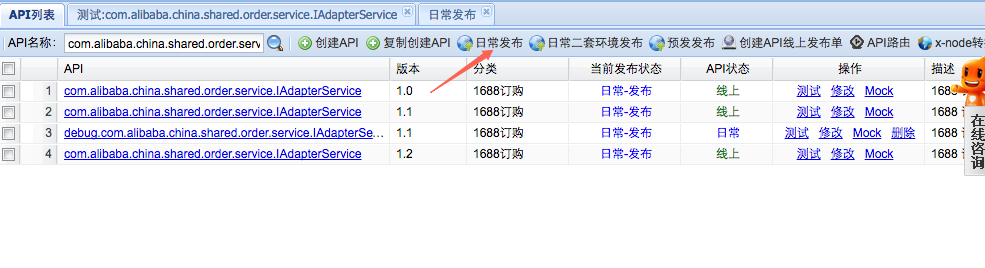

###1.每日一文-[《基于原生html的ui组件开发》](http://www.zhangxinxu.com/wordpress/2016/01/development-of-ui-components-based-on-native-html/)

###2.技术点滴

####2.1 移动的视口分为  view-viewPort 和 layout-viewPort

####2.2 如何获取移动端像素的缩放比例

####2.3 rem与em的区别
          rem是root em ，其大小是相对于根元素，也就是html的font-size来计算的，但是em是相对于父节点来计算的。所有的浏览器默认的根元素的大小是16px

####2.4 设备的独立像素指的是屏幕所能显示的逻辑像素
	```
	document.documentElement.clientWidth表示的是设备的逻辑像素
	```

###3.业务知识

####3.1 mtop数据修改了日常版本号之后，需要点击『日常发布按钮』才会生效


####3.2 页面异常
注意页面的js是否加载完毕。在移动端经常有js没有加载完毕的情况存在，有可能是环境劫持，有可能是异步加载被关闭。

####3.3 页面元素表现不正确包括html和css表现的不正确，注意html标签是否正常闭合。

####3.4 1px的显示问题
	在高分辨率（dpr>2）屏中显示1px的border，例如devicePixRatio=2中显示，

###4.心得感悟

####4.1

####4.2

####4.3

####4.4
###5.单词
