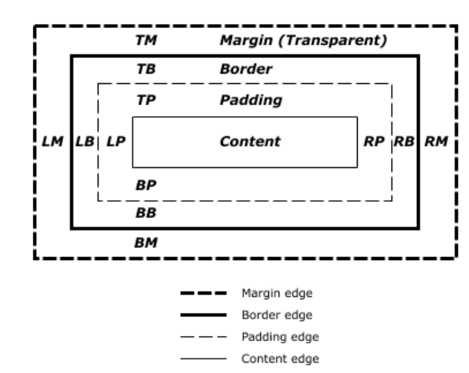
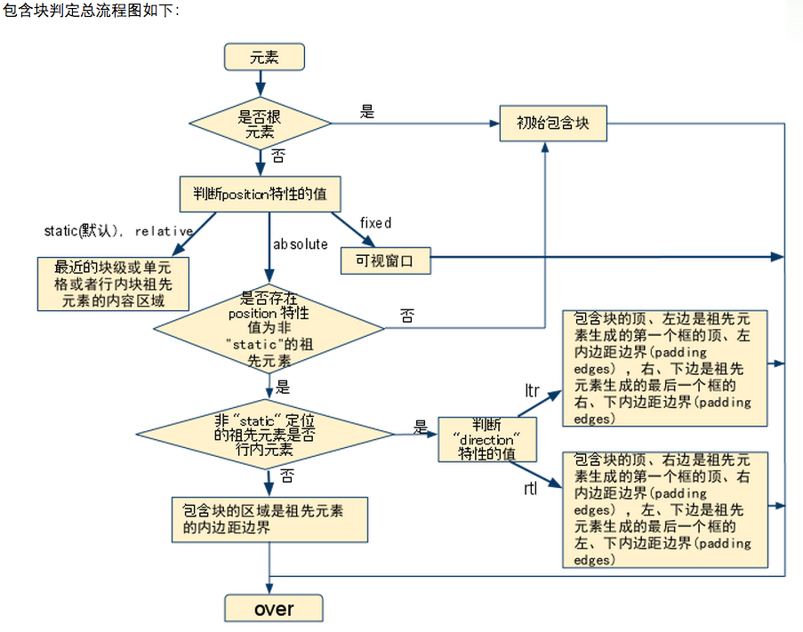

### 定位体系

* 常规流 
* 浮动
* 绝对定位

### 包含块

1. 创建包含块
* 根元素（html）所在的区域就是一个最初的包含块（initial containing block）
* 如果一个元素的position是relative 或者static，那么该元素的最近祖先的内容框就形成了一个包含块
* 如果元素的position是fixed，那么视口（continuous media）或者page area（paged media）就会创建包含快
* 如果一个元素的postion为absolute，那么该元素最近的祖先元素（该祖先元素的position必须不是static的任意值）就会  创建一个包含块，下面又分以下两种情况：

   
   * 如果该祖先元素师一个行内元素，那么包含块就位于边界黑子位于 第一个和最后一个行内盒子
   
   ```
   In the case that the ancestor is an inline element, the containing block is the bounding box around the padding boxes of the first and the last inline boxes generated for that element. In CSS 2.1, if the inline element is split across multiple lines, the containing block is undefined.
   ```
   * 否则包含块就是祖先元素的*padding edge*所包含的区域。
   
   **如果元素的祖先元素的所有position都是static，那么包含块就是最初包含块（html节点，initial containing block）**
   
    
    
   
   示例：<http://blog.csdn.net/danzhang1010/article/details/47608557>
   
2. 元素框的定位和尺寸与其包含块有关，而元素会为他的子孙元素创建包含块
 

### paged media && continuous media

* 分页媒体，例如纸张，ppt，书页。一般用于单页显示样式，例如把文档显示在projector，printer中。
* continuous media，文档的内容被分割成一个或者多个具体的页。例如把文档显示在tv，pc等。

### 如何计算宽度？
     width 属性不适合设置**非替换的行内元素**宽度，非替换的行内元素包括span，em等，替换的行内元素包括input，image等等

### float,position,display的关系

* display为none，那么就不会产生框，postion和float都没有效果
* position=fixed，absolute的优先级最高，float此时没有效果，display的取值也会调整，调整规则如
  [下面1](#justifyRule)
* 进行绝对定位和浮动的只能是块级元素和table元素


   
