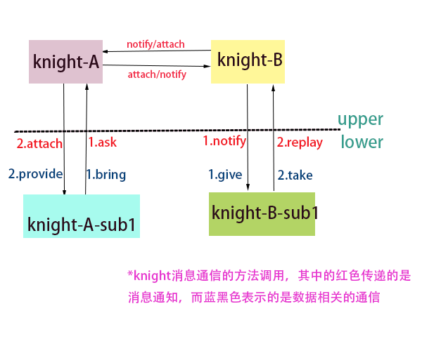

### justPage

注册页面所需模块，register的模块在DOM ready之后按照FIFO一次执行。use的模块在register执行完之后FIFO依次加载执行。

### knight-bin.js

1. bings/core中addHandler(name,option)中的option中有一个init函数，用于初始化一些什么东西？在core中为组件中所有的子item都绑定了一个运行的作用域。
2. event中swip ，swipLeft，swipRight,swipDown,swipUp表示的是什么？
3. 每一个scope都有attach方法？？？？在bindings/html中；scope的set ，notify方法等等。。。
4. 各个knight的通信调用的方法（该图不太正确，没能表现具体的含义。参见）
	
	
### 观察者模式
1. 用js写了一个观察者，还是不算太难，但是很久没写过js了，很多点都忘了，例如有关作用域与闭包的问题，在尝试将listener函数传到主体对象中，进行注册的时候，竟然将函数作为一个字符串进行了传入。⊙﹏⊙b汗

```
//主题对象
var subject=function(){
	this.state='origin';
	var _observers=[];
	this.addObserver=function(observer,listener,context){
		_observers.push({
			observer:observer,
			listener:listener,
			context:context
		});
	};
	this.delObserver=function(observer){
		
		for(var len=_observers.length,i=0;i<len;i++){
			if(_observers[i].observer.name== observer.name){
				_observers.splice(i,1);
				break;
			}
		}
	};
	this.notify=function(message){
		var o;
		if({}.toString.call(_observers)=='[object Array]'){
			for(var len=_observers.length,i=0;i<len;i++){
					o=_observers[i];
					o.listener.apply(o.context,arguments);
			}
		}else {
			return;
		}
		
	};
};
//定义第一个观察者对象
var observers=function(name){
	
	this.name=name;
	this.update=function(message){
		console.log("I am "+this.name+"the message from subject is:"+message.toString());
	}
};
//定义第二个观察者对象
var audience=function(name){
	this.name=name;
	this.attach=function(message){
		console.log("audience,I am"+this.name+"have been invoked..... the message from is "+"---->"+message.toString());
	};
}


var subject1=new subject();
var ob1=new observers("observer");
var ob2=new audience("audience");
subject1.addObserver(ob1,ob1.update,ob1);
subject1.addObserver(ob2,ob2.attach,ob2);
subject1.notify("I am china");
```
