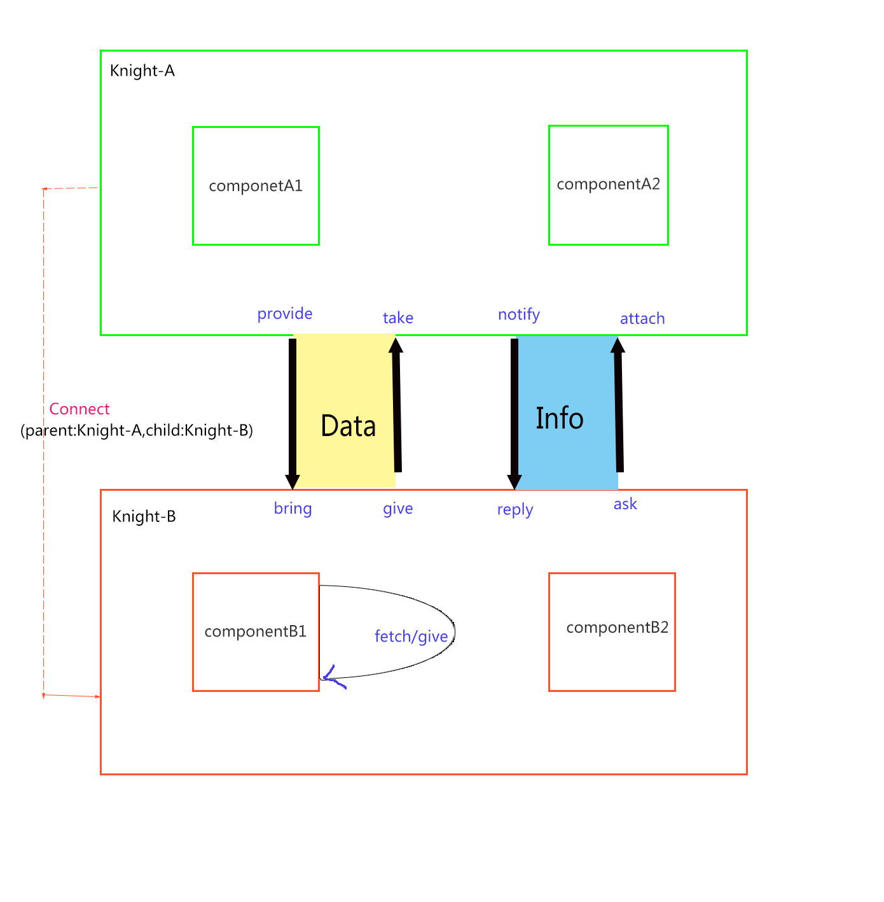

### 1.页面部件的逻辑关系，其实只有两种--同级与上下级。
『同级』：通过knight的include components实现。一个knight里面的所有components都是同级关系。

『上下级』：各个knights通过connect方法连接，构成上下级关系。亦如公司里面的层级关系。
### 2.knight的方法调用图

说明几点：

* knight里面主要将方法分为两大类：消息类方法和数据类方法。
* 每一类方法都是成对出现的。消息类的方法，一个监听，另一个调用。数据类的方法，一个是提供，一个是获取。之所以取这么多方法名字，主要是为了从字面含义来表达消息传递的方向是什么，例如：provide/bring，字面含义就是提供/获取，表示的是上级提供，下级获取。当然不能从英语单词严格的意义来区分，只有死记硬背，毕竟这儿的命名不太符合英语单词自身的语义。
* 自身也可以获取自身提供的消息，这儿典型的就是自身give了数据，然后自身又fetch了这个数据。

### 3.knight的数据实时更新
在knight里面还有两个很重要的方法，computed和observable。两者都是用来实时地更新数据，差别在于，computed是上游用来监听下游数据的变更，该函数的调用：

```
scope.computed("上下游链接标识","下游scope域内的变量","变化时的回调函数");
```
而observable是监听同域内的变量，调用形式是：

```
scope.observable("变量名（可以是数组）"，"变化时的回调函数")

```
### 4.使用knight框架的项目中的文件组织

使用knight的项目的文件组织结构大概是由以下几大部分构成：

* 每个knight是一个文件，例如make里面的『make-knight.js,order-knight.js』
* 每个knight里面的各个components是一个文件，例如make中的『order-knight.js』包含了『order-single.js』
* 下游想上游会提供（give）一些数据，我们统一将提供给上游的一些数据放在『X-linkup.js』这个文件里


