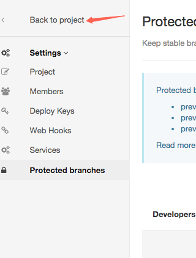

###git分支管理
1.如何设立分支是否受保护，受保护的分支不能被删除


2.建立本地分支与远程分支的关联

git push -u origin A ;将远程分支A 与本地分支A 关联，那么以后只需在本地执行`git push`就可以直接将变更推送到远程分支A上面，
但是需要注意此处的远程分支与本地分支名字是同样的，使用该命令最终其实修改的是`gitconifig`的文件，所以可以直接修改gitconfig的文件。只有与远程有关联的本地分支才会在gitconfig中记录。

```
[branch "C"]                    ;表示远程分支C
        remote = origin			 ;表示远程是哪个
        merge = refs/heads/C	;表示merge本地分支C

```

###git配置
1.`git config -e`用于打开config配置文件，然后就随意修改吧

2.`git config --global -l`;查看全局的变量配置，具体所有的操作可以随时使用`git config`来显示所有可能的操作

###git相关问题总结
**1.origin/A没有了，但是已经在本地A上做了修改，如何将本地A的更改推送到origin/B上呢？**

```
 1.在本地新建一个B分支,git branch B
 2.在B分支上合并A git merge A
 3.git push -u origin B:B ;使用改行命令将本地B和origin/B建立连接，那么以后只需git push 就能将commit推送到远程B上，不需要加任何参数
 
 ```
 ** 2.git 分支回滚**
    
    
    先将本地分支退回到某个commit，删除远程分支，再重新push本地分支 
    git reset --hard XXX  本地回滚  XXX版本号
    git push origin :feature/delete_order_347635 删除远程分支 冒号在前是删除
    git push origin feature/delete_order_347635: 推送分支到远程 冒号在后是推送
    
    
