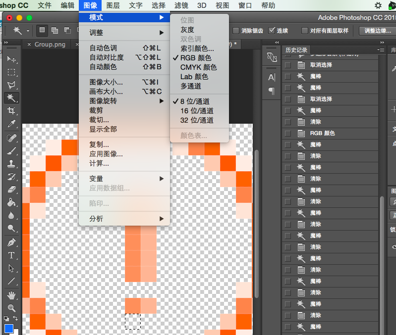
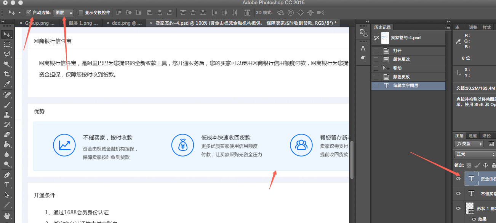

###抠图去掉某些背景
注意需要将图层选择为`rgb颜色`，索引会造成像素删不掉
### 自动选中页面中的图层
双击文字图层的T图标，就可以直接编辑，编辑完成之后`commond+enter`可以结束输入

###让图片蒙白的效果
打开图片-->新建填充图层-->调整新建图层的透明度，合并可见图层
 
###改变选区的填充色：
   首先选中选区-->图像（模式rgb）-->选区右键填充（选择颜色）