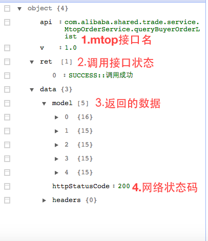

返回的数据格式

<!DOCTYPE html>
<html>
    <head>
        <meta charset="utf-8"/>
        <meta name="viewport" content="width=device-width, initial-scale=1.0, maximum-scale=1.0, user-scalable=no"/>
        <meta name="format-detection" content="telephone=no"/>
        <title>订单管理</title>
    </head>
    <body>
        <link rel="stylesheet" href="/lofty/port/lofty.css"/>
        <link rel="stylesheet" href="/just/css/kernel/just.css"/>
        <link rel="stylesheet" href="/just/css/lang/text.css"/>
        <link rel="stylesheet" href="/just/css/lang/button.css"/>
        <link rel="stylesheet" href="/just/css/mod/dialog.css"/>
        <link rel="stylesheet" href="/doit/css/lang/new-dpl.css"/>

        
        

        
        

        
        
        
        
       

		

    </body>
</html>
