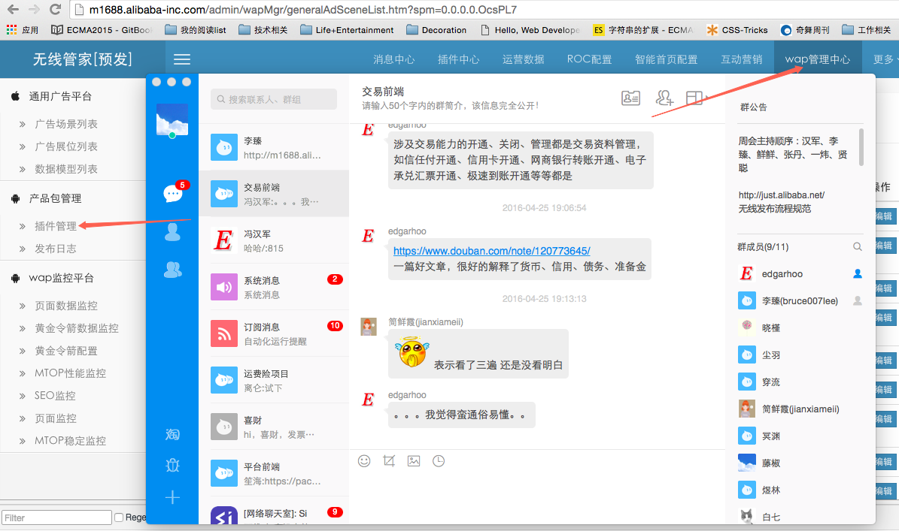

###如何发wap
在已有的style-wap-X分支之外，新建node分支，node分支相当于服务器端的webx，新建node-m-X应用，它和style-wap-X使用同一个分支，然后**预发布style和node分支**，然后绑定预发的ip地址。

```

##naga预发
110.75.98.154  detail.m.1688.com login.wapa.taobao.com
110.75.98.154  cart.m.1688.com
110.75.98.154  make.m.1688.com
110.75.98.154 m1688.alibaba-inc.com
110.75.98.154 wap.m.1688.com m.1688.com
110.75.98.154 trade.m.1688.com 
#110.75.98.154  astyle.alicdn.com style.china.alibaba.com astyle-src.alicdn.com style.c.aliimg.com 
110.75.98.154 astyle.alicdn.com style.china.alibaba.com style.c.aliimg.com 
140.205.73.18 astyle-src.alicdn.com

```

到[http://m1688.alibaba-inc.com/admin/wapMgr/wap_product_list.htm](http://m1688.alibaba-inc.com/admin/wapMgr/wap_product_list.htm)，修改产品版本号，点击预发布。
点击如图

就可以验证预发了，
等盖娅跑完自动化后，就可以发布正式了。

aone进入正式发布，**注意node和style一起发布**。然后去掉域名绑定，还是到[http://m1688.alibaba-inc.com/admin/wapMgr/wap_product_list.htm](http://m1688.alibaba-inc.com/admin/wapMgr/wap_product_list.htm)这儿修改线上正式的版本号，最后进行正式发布。

### WAP发布 doit 
在style-m-doit上开发，然后发布掉该分支，然后在style-wap-doit,node-m-doit再发布一次，这一次的分支是随便建立的，但是要确保style-wap-doit,node-m-doit 使用的是同一分支