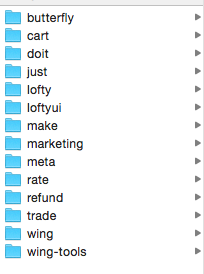
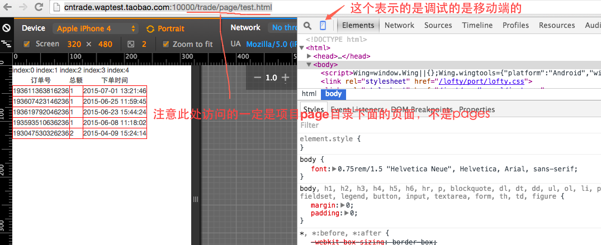
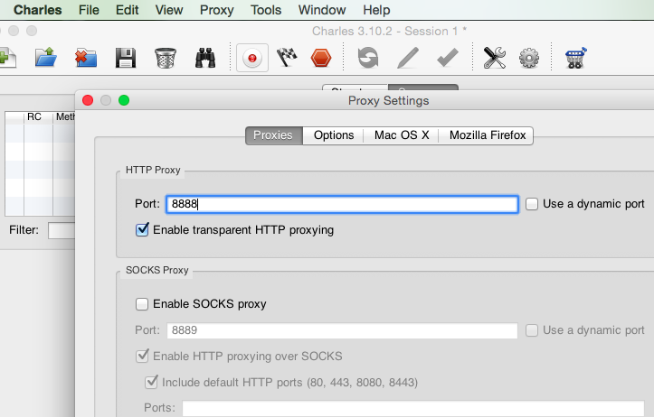
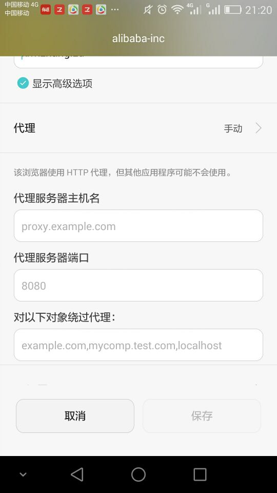

###1.按部就班搭建环境&拉取代码
[http://just.alibaba.net/guide/help/mobile/develop-start.html](http://just.alibaba.net/guide/help/mobile/develop-start.html) 


**tips：**

 * 文件放置的目录结构如下：所有的项目位于同一目录下，并且所有的应用目录都去掉了『style-m-』

 * 注意node的版本，使用node -v查看node的版本，如果node的版本过低，那么就是用```npm update n -g```来更新版本
 * 如果使用`sudo node wing server`来启动服务的时候，发现端口占用，一定要查看端口`10000`的占用情况，默认使用的是10000端口，kill占用端口的进程
### 2.打包应用
cd到wing-tools的所在的主目录下，然后运行`node --harmony  wing-tools/bin/wing build $project --base`此处一定要使用node的--harmony方式来打开,$project是应用名，例如此处的可能是trade，make等等
### 3.启动服务
按照[^1]中所示启动服务器，然后打开chrome浏览器，输入网址，调出控制台。这个时候首先会出来一个页面进行登录，登录的用户名和密码：

买家：cllbuyer001 
卖家：cllseller001 
密码：taobao1234 

  **tips**
如果页面打不开，可以尝试先打包应用，再开启服务。

`特别要注意的是，一定要在项目的根目录下面去启动wing  server服务`


### 4.在手机端查看页面
* 本地开启charles的代理服务

* 设置本地的wlan代理，如下图：其中的主机名是pc的ip，端口就是charles的端口
* 打开浏览器输入网址就可以访问
### 5.配置线上的mtop进行请求
将本地的host不要配置成*.waptest.taobao.com  那么mtop请求就会去请求线上的环境
在host中这样配置：
`127.0.0.1 trade.m.taobao.com`
在浏览器中请求这个地址：
`http://trade.m.taobao.com:10000/trade/page/buyerOrderList.html`


 
[^1]: 无线入门重点参考资料[http://just.alibaba.net/guide/help/mobile/develop-start.html](http://just.alibaba.net/guide/help/mobile/develop-start.html). 