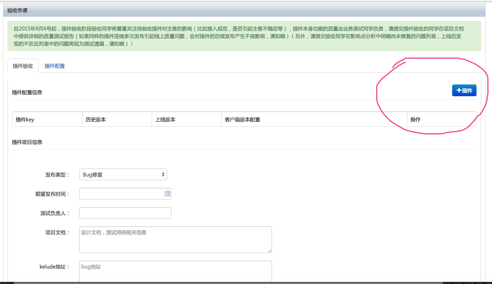
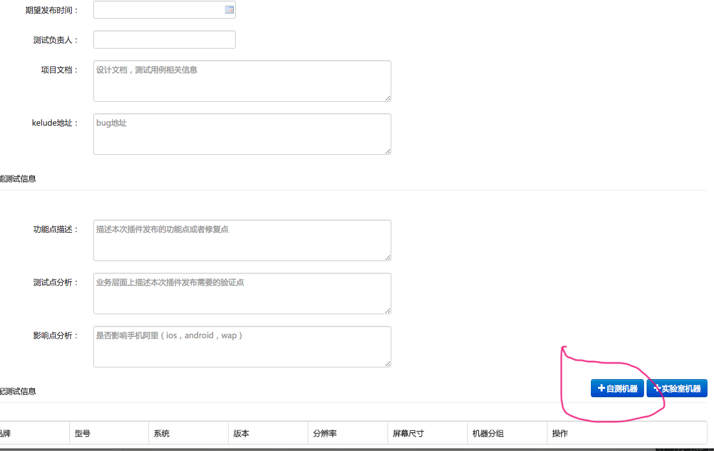

  发布之前：

1. 修改版本号。

2. git add -A ;记得提交所有的代码

发布：

1. 和普通pc发布一样，aone中发布，发到线上。

2. 申请项目的模块变更。发布到线上的，再发布模块。发布模块指导[http://docs.alibaba-inc.com/pages/viewpage.action?pageId=253306465](http://docs.alibaba-inc.com/pages/viewpage.action?pageId=253306465)** 注意合并到master分支。**

3. 主客线上环境，打开灰度测试，打开主客的灰度测试按钮，下载灰度测试包。

4. 盖娅中提交发布单。[http://mytest.alibaba-inc.com/wireless/product/product_online_apply.htm?flowType=PluginFunction](http://mytest.alibaba-inc.com/wireless/product/product_online_apply.htm?flowType=PluginFunction) 

注意：
		

		