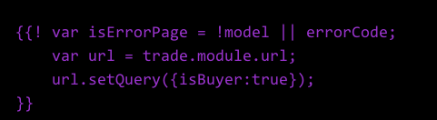

#目录
##1.开发
#### 1.1. 环境搭建
#### 1.2. 必备知识
#### 1.3. 开发流程
#### 1.4. naga的开发
##2.调试
#### 2.1. 基本调试
#### 2.2. 主客调试
#### 2.3. 灰度测试
##3.发布
####3.1. aone发布分支
####3.2. aone模块变更
####3.3. geae提交发布单
##4.Notice&&Bugs
####4.1. mtop
####4.2. iscorll
####4.3. css
####4.4. wing
####4.5. 发布注意事项
####4.6. 键盘弹出事件处理
##5.业务
####5.1 物流
####5.2 订单状态
####5.3 用户操作
####5.4 保障信息


------------------------------------------------
##1.开发

#### 1.1. 环境搭建
主客开发环境搭建，参照

   [just无线环境搭建](http://just.alibaba.net/guide/help/mobile/develop-start.html)此处的登录链接是：[login.waptest.taobao.com/login.htm?ttid=h5 ](login.waptest.taobao.com/login.htm?ttid=h5 )
   
   [无线开发环境搭建-个人总结.md](http://gitlab.alibaba-inc.com/kiwizhang.zd/kiwi-blog/raw/master/_book/Note-Book/%E6%97%A0%E7%BA%BF%E5%BC%80%E5%8F%91/%E5%85%A5%E9%97%A8/%E6%90%AD%E5%BB%BA%E6%97%A0%E7%BA%BF%E5%BC%80%E5%8F%91%E6%9C%AC%E5%9C%B0%E7%8E%AF%E5%A2%83.html)

* 注意要将wing-tools,wing,butterfly,just,doit,trade……这些项目全都clone到**同一个目录（此处举例使用workspace）**下
* 执行`wing-tools/bin/wing server`启动服务时，必须在workspace目录下执行该命令
* 配置主客开发的日常host：

```
127.0.0.1   cntrade.waptest.taobao.com #style-m-trade日常环境
#127.0.0.1   cntrade.m.taobao.com #style-m-trade,style-wap-trade生产环境
s
```
* charles（fiddler），winire都是必备的辅助调试工具。。
* 在浏览器中登录的链接是[login.waptest.taobao.com/login.htm?ttid=h5 ](login.waptest.taobao.com/login.htm?ttid=h5 )
* 浏览器中访问列表的地址：[http://cntrade.waptest.taobao.com:10000/trade/page/buyerOrderList.html](http://cntrade.waptest.taobao.com:10000/trade/page/buyerOrderList.html)
* 主客里访问进货单，还需要通过此地址[http://cntrade.waptest.taobao.com:10000/login](http://cntrade.waptest.taobao.com:10000/login)登录


#### 1.2. 必备知识
* art模板的基本语法
   * if,each，
   * art中如何书写js代码**注意感叹后之后要有空格**，
   * art中引入其他非本产品包的view（trade引入doit）
* **[wing的基本架构](http://gitlab.alibaba-inc.com/wing/wing-doc/raw/gitbook/_book/index.html)**
* less语法
* just/aom
	* just/aom/location （location.open,location.close关闭订单功能）
	* just/aom/action   (action.get查询物流信息,action.post主客使用有问题)
	* just/aom/bridge(调用系统黏贴板功能)
	* 如何定义art模板的helper方法
     （**使用just.def，而不是define**	）


#### 1.3. 开发流程
  1. 启动`sudo wing-tools/bin/wing server`，完成页面开发，在chrome中查看页面效果。如果art编译错误，**注意查看控制台报的错误，如果不能定位错误，将该art编译的函数体字符串，copy出来，替换掉其中`\n '' `等字符串，然后放到控制台中运行，可以定位出错位置。**
  2. 手机浏览器中测试页面，
   chrome，UC，safari各个调试方法都不一样。chrome浏览器测试使用:[在手机端查看页面](http://gitlab.alibaba-inc.com/kiwizhang.zd/kiwi-blog/raw/master/_book/Note-Book/%E6%97%A0%E7%BA%BF%E5%BC%80%E5%8F%91/%E5%85%A5%E9%97%A8/%E6%90%AD%E5%BB%BA%E6%97%A0%E7%BA%BF%E5%BC%80%E5%8F%91%E6%9C%AC%E5%9C%B0%E7%8E%AF%E5%A2%83.html)在UC中，可以使用wenire,[调试方法](http://gitlab.alibaba-inc.com/kiwizhang.zd/kiwi-blog/raw/master/_book/Note-Book/%E6%97%A0%E7%BA%BF%E5%BC%80%E5%8F%91/%E5%85%A5%E9%97%A8/%E4%BD%BF%E7%94%A8weinre%E8%B0%83%E8%AF%95app%E4%B8%AD%E7%9A%84%E9%A1%B5%E9%9D%A2.html)
  3. 打包应用，现在已经不区分是ios或者安卓，直接使用
  `sudo wing-tools/bin/wing build $productname --base`
  3. 主客测试
  ios直接切换到日常模式，打开插件扫描功能，spdy降级（启用http协议，而不是https），然后扫码安装包。二维码url：
  
  ```
  http://10.17.217.110:10000/doit/dist/doit-base-0.1.36.wz;http://10.17.217.90:10000/trade/dist/trade-base-0.3.15.wz;http://10.17.217.110:10000/just/dist/just-base-0.1.22.wz#product
  #注意替换其中的ip和版本号等信息
  
  ```
  安卓的测试流程和上面的相同，只不过需要到[这个地方](http://mytest.alibaba-inc.com/wireless/archive/archive_list.htm?platform=ANDROID)，下载新的日常测试版主客安装。
#### 1.4 naga的搭建

naga就是一个webserver，与wing类似，但是webserver给客户端传输的是html，是将所有模板已经编译好，所有的js helper方法也已经执行了，naga环境的搭建参考[http://gitlab.alibaba-inc.com/olps_cn/naga/tree/master](http://gitlab.alibaba-inc.com/olps_cn/naga/tree/master),启动nage服务，配置naga本地开发host：

```
127.0.0.1         wap.m.1688.com
127.0.0.1        m.1688.com 
127.0.0.1        trade.m.1688.com
127.0.0.1        cart.m.1688.com
127.0.0.1        make.m.1688.com

127.0.0.1 astyle.alicdn.com style.china.alibaba.com style.c.aliimg.com astyle-src.alicdn.com

10.125.194.3  pass.1688.com
10.125.194.3  login-test.1688.com pass.pass-test.1688.com  
```
然后在浏览器中输入登录地址：*http://wap.m.1688.com:7001/page/login.html*,
访问订单列表的url：

`naga发布参考资料：`[http://www.atatech.org/articles/37717?spm=0.0.0.0.VI9KxC&rnd=221299637&rnd=235863657](http://www.atatech.org/articles/37717?spm=0.0.0.0.VI9KxC&rnd=221299637&rnd=235863657)；
预发host：

```
##naga预发
110.75.98.154  detail.m.1688.com login.wapa.taobao.com
110.75.98.154  cart.m.1688.com
110.75.98.154  make.m.1688.com
110.75.98.154 m1688.alibaba-inc.com
110.75.98.154 wap.m.1688.com m.1688.com
110.75.98.154 trade.m.1688.com 
#110.75.98.154  astyle.alicdn.com style.china.alibaba.com astyle-src.alicdn.com style.c.aliimg.com 
110.75.98.154 astyle.alicdn.com style.china.alibaba.com style.c.aliimg.com astyle-src.alicdn.com
```

**注意：1.交易线的trade是style-wap-trade，不是style-m-trade，所以需要替换naga/products下面的trade文件，但是无论是完成wap-trade或者m-trade都要进行一个代码功能的同步**

**2.支付宝中的云市场实际是运行在支付宝提供的一个浏览器中，所以可以通过扫码访问任何url。如果需要修改art模板。那么就需要进行很复杂的工序，例如可能需要上预发验证。**

**3.支付宝里面的云市场,如果需要查看1688会员的订单列表，
* 那么可以直接通过云市场扫码[http://wap.m.1688.com/page/login.html](http://wap.m.1688.com/page/login.html)登录之后，*

* [查看订单列表url](http://trade.m.1688.com/page/buyerOrderListForYunMarket/view.html)

```
* <a href="http://make.m.1688.com:7001/page/f2fPlaceOrder.html?client=wireless&service=orderMutilViewService&param={"client":"wireless","goodsParams":[{"flow":"face","offerId":"-1","quantity":1,"specId":""}],"nonCriticalProperties":{"extId":{"seller":"b2b-3656360942","site":"1123","src":"cloud"}}}
">当面付的下单交易页面url(日常开发)</a>


* [当面付的下单交易页面url（线上）](http://make.m.1688.com/page/f2fPlaceOrder.html?client=wireless&service=orderMutilViewService&param=%20{%22client%22:%22wireless%22,%22goodsParams%22:[{%22flow%22:%22face%22,%22offerId%22:%22-1%22,%22quantity%22:1,%22specId%22:%22%22}],%22nonCriticalProperties%22:{%22extId%22:{%22seller%22:%22b2b-2249991577%22,%22site%22:%221123%22,%22src%22:%22cloud%22}}})
* [进货单页面](http://cart.m.1688.com:7001/page/cart.html)

```


##2.调试
#### 2.1. 基本调试
  1. art模板编译错误，一定要注意复制拷贝代码过程中，有些编辑器会丢失js代码双括号+感叹号之后的空格
   
  
  2. art模板运行时错误。chrome中打开该模板编译的js，然后断点，一步一步调试。

#### 2.2. 主客调试
 * 使用weinre调试方法[无线项目模块与调试 介绍(李臻)](http://docs.alibaba-inc.com/pages/viewpage.action?pageId=177931364 )  ，
   * 需要注意调试完成之后，需要去掉在index.html中插入的脚本，否则会因为脚本加载失败，造成页面加载失败的问题
   * 由于ip的变化，会造成weinre访问失效的问题，所以需要修改ip。  
 * 安卓有自带调试功能的app，需要向安卓开发人员询问，安装了该app之后，在pc浏览器中通过 手机ip:9998就可以调试页面了。   
         
#### 2.3. 灰度测试
通过彩蛋打开灰度测试功能（主客消息提醒设置-->振动（不停点击）-->输入密码：wx1688syycjf），然后下载灰度产品包，注意产品包的版本号。

##3.移动端发布
####3.1. mobile-aone发布分支
  和pc发布一样。
####3.2. mobile-aone模块变更
  参照：[http://docs.alibaba-inc.com/pages/viewpage.action?pageId=253306465](http://docs.alibaba-inc.com/pages/viewpage.action?pageId=253306465)
  注意发布时合并到master分支
####3.3.mobile- geae提交发布单
参照：[无线发布步骤](./搭建无线开发本地环境.md)
####3.3.wap- wap的预发和发布
参照：[wap的预发和发布](./wap预发与发布.md)
	
   

##4.Notice&&Bugs
####4.1. mtop
  * 和后端约定数据接口，然后去[mtop平台](http://platform.api.wapa.taobao.com/main.htm)测试该数据接口是否正确,如果不正确，需要找后端确认。
  * ds文件，直接去mtop平台下载，不要自己write，no write no die..
  
####4.2. iscorll
   iscroll实现了页面刷新的问题，但是需要注意当给页面中的一些需要滚动的控件（textarea）添加滚动事件时，注意touchstart,touchmove,touchend手势，需要通过阻止事件的冒泡触发页面的滚动     
   
####4.3. css
  * 在使用flex的时候，需要注意在低版本的android浏览器中，是不支持flex的部分属性的。例如flex-wrap，在低版本中是不支持的，具体使用的时候需要查询一下该属性的适用范围，[http://caniuse.com/](http://caniuse.com/)
  * 脱离了文档流的块在UC浏览器（包括采用了UC内核的webview）都存在键盘滚动，重新定位出现空白区域的bug，至今该bug未被修复
  * 在taobao域名下，不要给**div的class属性命名成open**。会被UC屏蔽掉该div的展示
  
####4.4. wing
* 请求mtop的值，如果一个请求字段是required，那么在请求的时候必须给该字段传入值，如果该值是undefined或者null，都会报错。
* 使用url传值的时候，注意使用`window.encodeURIComponent`去编码

####4.5 发布注意事项
* 修改版本号(package.json中的version)
* ** git status**查看文件的修改记录，注意提交所有的文件

####4.6. 键盘弹出事件定位处理
已经封装实现好了，使用方法参考**doit/example/widget/layout/index.html**

##5.业务

####5.1 物流
每个订单可能有多个运单，每个运单都有其物流信息

####5.2 订单状态
订单由于有多阶段订单和单阶段订单之分，订单状态和阶段信息都是由后台输出，前端不做判断。

####5.3 用户操作
4.0的订单除了查看物流操作，其余操作都没有，大市场的订单有部分操作。（没有站在客户的角度思考用户的需求，用户需要的不是界面，而是功能）

####5.4 保障信息
卖家为自己的商品开通保障功能。保障信息反映在每个商品上，每笔订单会有商品关联的保障服务订单信息。
