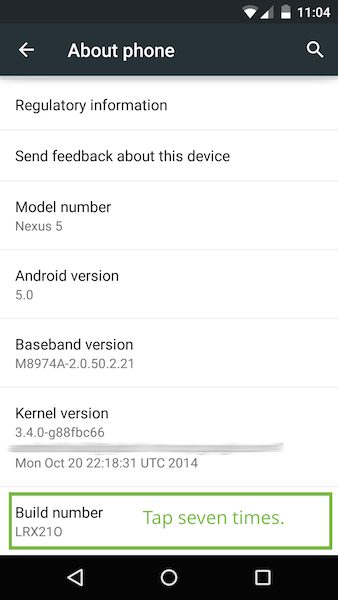

### 1. 如何调试移动端的web页面？
** reference**:[https://developer.chrome.com/devtools/docs/remote-debugging#port-forwarding](https://developer.chrome.com/devtools/docs/remote-debugging#port-forwarding)
 
 **移动端：**
 
 1.安卓连接电脑。打开安卓的usb调试，彩蛋打开方式：
 
 
 
 2.安卓和pc的网络实现互通。使用charles建立一个上网代理，并且手机的wlan设置成通过charles的代理上网
 
  **pc：**
  
  1.通过chrome://inspect找到设备，调试手机端打开的页面
 