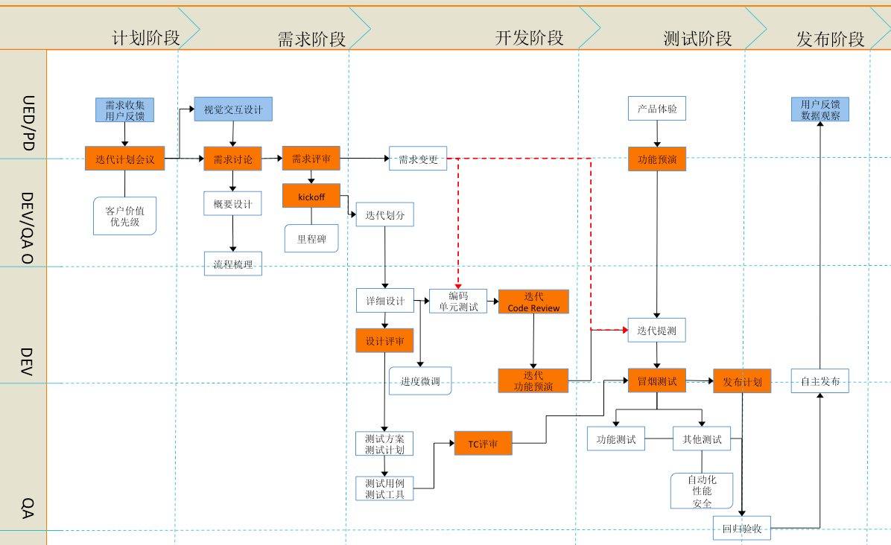

# 项目开发规范流程

说明几点：
* 计划阶段:需求迭代会议，PM（project manager）阐述对未来需求开发的安排。

* 需求阶段:概要设计（开发），流程梳理（测试），需求评审，kickoff

* 需求变更，不能发生在提测的时候，进行需求变更，可以在编码和单元测试的时候进行需求变更。

* 详细设计之后，可以进行进度微调。

* 功能预演在提测之前。功能预演由测试来组织。功能预演包括产品，UED，交互，开发，测试都要与会。

* 发布计划一定要做 ，准备好checklist，包括项目的发布顺序，项目如何回滚，配置项等。`!因为没有做好发布计划，配置项没有配置，回滚操作错误，交易后端出过P1故障`

* 产品上线后两周，产品要将数据和用户反馈 发给开发。