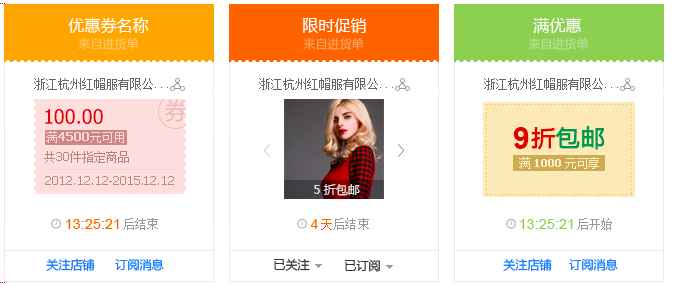
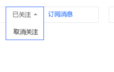
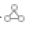

### 促销中心_订阅的促销页面概要设计

#### 页面功能

从需求上看，页面的主要功能如下：

* 展示订阅的促销信息，用户可以通过该页面查看“进行中”的促销，“未开始”的促销，“已过期”的促销
* 关注店铺，取消关注店铺
* 订阅消息，取消订阅消息
* 删除已过期的促销

#### 促销信息分类
促销方式有三种：

* 使用优惠劵的促销
* 限时促销方式
* 满减优惠

### 促销中心_订阅的促销页面详细设计
#### html&CSS

* 从视觉设计稿看，抽象页面模块,整个页面抽象成三个mod，分别用于:
  * 展示“进行中”（mod-undergoing.css）的促销
  * “未开始(mod-unstart.css)”的促销
  * “已过期(mod-end.css)”的促销.

* 页面目前暂定有三种类型，这三种类型的劵的头部颜色暂时按照，劵的类型来区分：

  * unit/coupon-discount.css 优惠券促销
  * unit/timelimited-discount.css 限时促销
  * unit/full-discount.css 满减优惠促销
  
* 所有券的基本(共同)样式 zone/subscribed-discount.css

* 基本的小控件
  * unit/unit-droppable.css

  * unit/unit-relationship-lookback-button.css
  
  * unit/unit-end-icon.css
  
