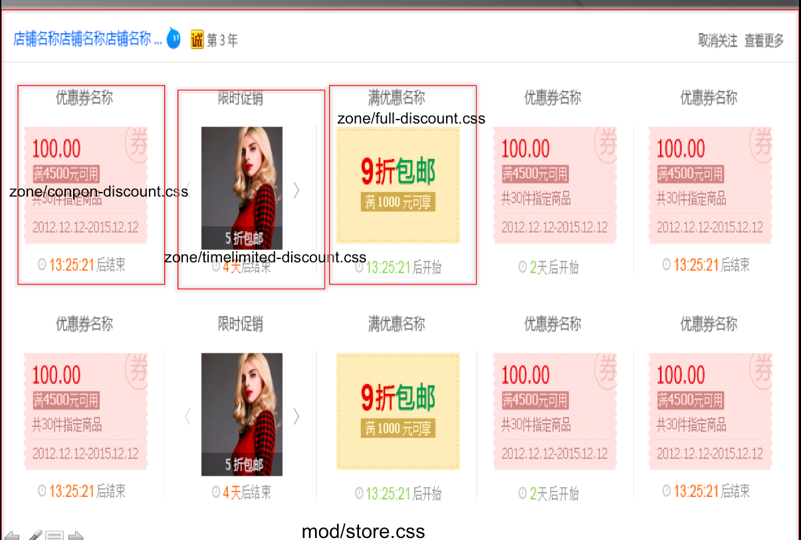

### 促销中心_关注的店铺促销页面概要设计
从需求上看，页面的主要功能是展示关注店铺的促销信息，用户可以通过该页面查看所有关注店铺的名称，取消关注店铺，查看店铺的所有促销信息。
#### 促销信息展示
促销方式有三种：
* 使用优惠劵的促销
* 限时促销方式
* 满减优惠

### 促销中心_关注的店铺促销页面详细设计
#### html&CSS
从视觉设计稿看，抽象页面模块,用户关注的店铺促销信息，整个店铺对应一个mod，每个mode展示区块展示该店铺的促销信息，总共有三种类型的优惠，分别对应三个zone，css文件与区块的对应文件如下：

页面总共有:

* layout.css 用于整个页面的布局样式
* mod/store.css 主要用于展示店铺信息
* zone/coupon-discount.css 优惠券促销
* zone/timelimited-discount.css 限时促销
* zone/full-discount.css 满减优惠促销

#### JS

