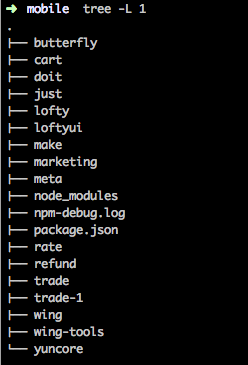
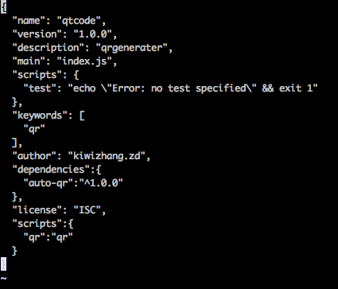
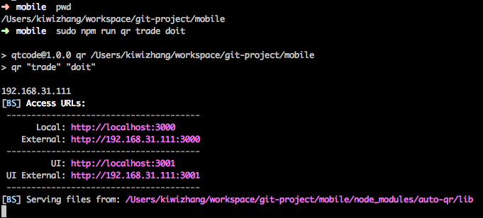
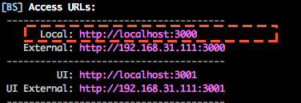
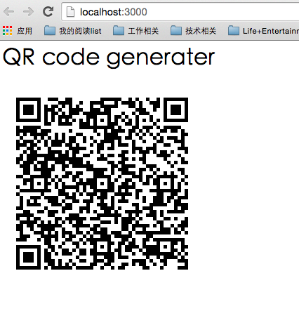

###移动端开发自动QR生成工具使用说明
####工具背景介绍
目前在移动端开发过程中，build产品包之后，需要使用主客的扫码工具扫描最新产品包的url。如果修改了产品包的version之后，或者电脑的ip地址变换了之后，都需要自己重新拼接产品包的url，过程琐碎而复杂，为了简化开发流程，就萌发了开发自动qr工具的想法。
####实现原理
监听产品包的package.json文件的变化，一旦发生变化就重新生成一个最新的二维码。
####安装使用：

1. 所有的移动产品包都放在同一个文件夹下面，例如此处所有的产品包和工具包（wing-tools）都放在一个名为mobile的文件夹下,在该文件夹下面如果已经有了一个`package.json`文件夹，那么就不需要`npm init`，否则首先执行`npm init`,然后 `npm install auto-qr --save`

2.安装好了之后，需要配置一个命令行工具，打开`mobiles/package.json`,加入`scripts:{"qr":"qr"}`

3.安装好了之后呢，就可以运行了,*注意，必须将当前的命令行工作目录切换到mobiles目录*
`sudo npm run qr [product-name1] [product-name2]`,此处的`sudo `必修加上，以免因为权限问题监控不了`package.json`文件,产品包的名字可以有若干个，如果你同时开发了几个产品包。

4.然后在浏览器中就会自动打开一个页面，该页面的url就是local

在开发期间不要关闭页面，修改了版本后该页面会自动刷新显示最新的url

####tips：
1.注意首先是开启`wing-tools server`，然后运行`sudo npm run qr [product-name1] [product-name2]`，

2.本工具只是按照`package.json`的version生成了url，但是并不保证在产品包的dist目录下有该版本的产品包，所以需要`wing-tools build`之后，再扫描二维码安装。

3.二维码扫描之后的url是这样的,一个产品包的情况：

`http://${ip}:${port}/${app}/dist/${app}-base-${version}.wz#product`

多个产品包的情况是这样的：

`http://${ip}:${port}/${app}/dist/${app}-base-${version}.wz;http://${ip}:${port}/${app}/dist/${app}-base-${version}.wz#product`

此处默认的都port是*10000*,后续继续开发的话，会考虑做成配置化的。

4.该工具的安装过程稍慢，请耐心等待:)
#### 反馈
有任何意见请反馈至：
[zd10101501](mailto:zd10101501@163.com) thanks!

