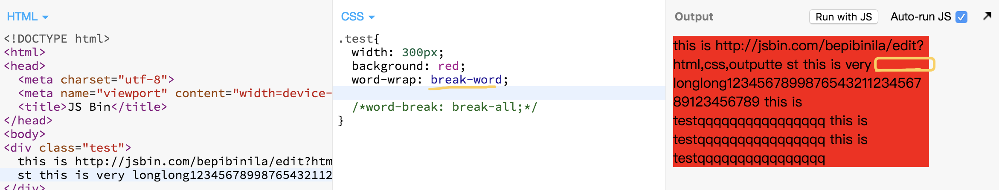
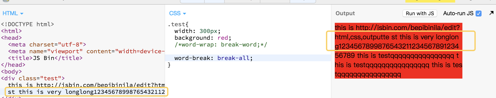

  ## 周一
### bugs
* **[question]** charles can't proxy the chrome http or https request

	**[reason]** charles can't proxy the request if the request has been established before the charles session is open
	
	**[method]** check the SSL  certification in  charles and chrome if are all right(can check follow this [document](https://www.charlesproxy.com/documentation/using-charles/ssl-certificates/)) and then start charles at first and then start the chrome.
## 周三
### segments
* isNaN()  
* word-wrap & word-break
	* word-wrap:break-word会首先起一个新行来放置长单词，新的行还是放不下这个长单词则会对长单词进行强制断句；
	  而word-break:break-all则不会把长单词放在一个新行里，当这一行放不下的时候就直接强制断句了。
    如下图所示： 如果是`word-wrap: break-word`  ，
     
    黄色部分是空的,`word-break: break-all`  一行是填满了。然后折断了
## 周五
### segments
* 正向代理（***翻墙***）是一个位于客户端和目标服务器之间的代理服务器(中间服务器)。为了从原始服务器取得内容，客户端向代理服务器发送一个请求，并且指定目标服务器，之后代理向目标服务器转交并且将获得的内容返回给客户端。正向代理的情况下客户端必须要进行一些特别的设置才能使用。

  反向代理（***nginx代理对后端的请求，实现跨域访问***）正好相反。对于客户端来说，反向代理就好像目标服务器。并且客户端不需要进行任何设置。客户端向反向代理发送请求，接着反向代理判断请求走向何处，并将请求转交给客户端，使得这些内容就好似他自己一样，一次客户端并不会感知到反向代理后面的服务，也因此不需要客户端做任何设置，只需要把反向代理服务器当成真正的服务器就好了。

  